# Rook Logic — Full Simulation & Diagram

> **Version**: 1.1 (post-fix)  
> **Last updated**: 2026-04-09  
> **Status**: Verified against all `.clinerules/` files and ticket schemas

---

## Bugs Fixed in This Commit

| ID | Severity | Description | Fix |
|----|----------|-------------|-----|
| B1 | 🔴 Critical | `MUM-T01` wrote YAML with raw MUMPS strings → `yaml.ParserError` on gate | Switched output to pure JSON; updated test and ticket |
| B2 | 🔴 Collision | `04-coder.md` and `04-executor.md` both existed; coder loaded first | Renamed coder to `07-coder-reference.md` |
| B3 | 🟡 Conflict | `02-lifecycle.md` required human approval gates; conflicted with YOLO loop | Added YOLO Mode Override section to `02-lifecycle.md` |
| B4 | 🟡 Path | `parse_mumps.py` wrote to `output/sample/sample_ast.json`; ticket had `.yaml` path | Aligned ticket `result_path` and step 3 to `.json` |

---

## File Contract Map (v1.1 — Post-Fix)

| File | Produces | Format | Consumed By |
|------|----------|--------|-------------|
| `sample.m` | MUMPS source | `.m` text | `MUM-T01` step 1 |
| `tools/mumps/parse_mumps.py` | AST data | pure JSON dict | `MUM-T01` step 2 |
| `output/MUM-T01-ast.json` | AST artifact | pure JSON | `tests/test_T01.py` gate |
| `tests/test_T01.py` | Gate result | exit 0/1 | `05-stack-runner.md` loop |
| `logs/journal.jsonl` | Audit trail | JSONL | `tests/harness/test_02_journal_audit.py` |
| `logs/scratch-MUM-T01.md` | Working memory | Markdown | Rook retry self-correction |
| `tickets/closed/MUM-T01.yaml` | Completion proof | YAML | Dep check for MUM-T02+ |

---

## Rook Execution Flow

```mermaid
flowchart TD
    %% ── BOOT ──────────────────────────────────────────────────────────────
    CHAT["💬 Human pastes START.md prompt\ninto Cline chat"]
    READ_RULES["📖 Read .clinerules/ in filename order\n00 → 01 → 02 → 03 → 04-executor → 05-stack-runner → 06-audit → 07-coder-ref"]
    READ_SETTINGS["⚙️ Read settings.yaml\nexecutor · ticket dirs · max_retries"]
    BOOTSTRAP["📝 Layer 1 Bootstrap\nGenerate UUID session\nWrite logs/.session\nEmit SESSION_START → journal.jsonl"]

    CHAT --> READ_RULES --> READ_SETTINGS --> BOOTSTRAP

    %% ── MAIN LOOP ────────────────────────────────────────────────────────
    SCAN["🔍 STEP 1 — Scan tickets/open/\nCheck depends_on for each ticket"]
    BOOTSTRAP --> SCAN

    EMPTY{"tickets/open/\nempty?"}
    NONE_READY{"Open tickets exist\nbut none ready?"}

    SCAN --> EMPTY
    EMPTY -- Yes --> DONE["✅ SESSION_END reason: DONE\nAppend REPLICATION-NOTES.md\nStop"]
    EMPTY -- No --> NONE_READY
    NONE_READY -- Yes --> BLOCKED["⛔ SESSION_END reason: BLOCKED\nAppend REPLICATION-NOTES.md\nStop"]
    NONE_READY -- No --> SELECT

    %% ── TICKET SELECT ────────────────────────────────────────────────────
    SELECT["🎯 STEP 2 — Select ready ticket\nLowest lexicographic ID\nHARN-T01 before MUM-T01"]
    SELECT --> START_T

    %% ── TICKET START ─────────────────────────────────────────────────────
    START_T["📋 STEP 3 — Start Ticket\n① Move YAML: open/ → in_progress/\n② Increment attempts\n③ Emit TICKET_START → journal\n④ Create logs/scratch-{id}.md"]
    START_T --> EXEC

    %% ── EXECUTE STEPS ────────────────────────────────────────────────────
    EXEC["⚙️ STEP 4 — Execute task_steps\nPer step:\n• Check off in scratch\n• Emit TOOL_CALL pending → journal\n• Run tool (allowed_tools only)\n• Emit TOOL_CALL ok/error → journal\n• Log anomalies to scratch immediately"]
    EXEC --> GATE

    %% ── GATE ─────────────────────────────────────────────────────────────
    GATE["🧪 STEP 5 — Run Gate\n① Emit GATE_RUN pending → journal\n② Execute gate_command via shell\n   e.g. pytest -q tests/test_T01.py\n③ Emit GATE_RUN pass/fail → journal"]
    GATE --> GR{"Exit code 0?"}

    %% ── GATE PASS ────────────────────────────────────────────────────────
    GR -- Pass --> CLOSE["✅ TICKET_CLOSED\n① Move YAML: in_progress/ → closed/\n② Emit TICKET_CLOSED → journal\n③ Delete logs/scratch-{id}.md\n⚠️ DO NOT summarize\n⚠️ DO NOT ask\nReturn immediately to STEP 1"]
    CLOSE --> SCAN

    %% ── GATE FAIL ────────────────────────────────────────────────────────
    GR -- Fail --> RC{"attempts <\nmax_retries?"}
    RC -- Yes --> RETRY["🔁 TICKET_RETRY\n① Emit TICKET_RETRY → journal\n② Move YAML: in_progress/ → open/\n③ Re-read scratch file\n④ Note retry reason in Anomaly Log\nReturn to STEP 1"]
    RETRY --> SCAN

    RC -- No --> FAIL_T["💥 TICKET_FAILED\n① Emit TICKET_FAILED → journal\n② Move YAML: in_progress/ → failed/"]

    %% ── LAYER 3 LIVING DOCS ──────────────────────────────────────────────
    FAIL_T --> L3["📚 Layer 3 — Living Docs\n① Save stdout/stderr → logs/ISS-{date}-{desc}.log\n② Append block → TROUBLESHOOTING.md\n③ Overwrite ISSUE.md with escalation YAML\n④ Append row → REPLICATION-NOTES.md"]
    L3 --> ESC["🚨 SESSION_END reason: ESCALATED\nleave tickets/failed/ intact\nStop all work"]

    %% ── AUDIT LAYERS SUBGRAPH ────────────────────────────────────────────
    subgraph AUDIT ["🗂️ Three Audit Layers (06-audit.md)"]
        direction TB
        LA1["Layer 1 — JSONL Journal\nlogs/journal.jsonl — append-only\nEvents: SESSION_START · SESSION_END\nTICKET_START · TICKET_CLOSED\nTICKET_RETRY · TICKET_FAILED\nTOOL_CALL before+after\nGATE_RUN before+after"]
        LA2["Layer 2 — Scratchpad\nlogs/scratch-{id}.md\nCreated: TICKET_START\nContents: checked steps + anomaly log\nDeleted: TICKET_CLOSED\nArchived as -FAILED.md: TICKET_FAILED"]
        LA3["Layer 3 — Living Docs\nTROUBLESHOOTING.md (append on FAILED)\nREPLICATION-NOTES.md (append on SESSION_END)\nISSUE.md (overwrite on FAILED)"]
    end
```

---

## Stop Conditions (Exhaustive)

| Condition | Reason in Journal | What Happens |
|-----------|------------------|--------------|
| `tickets/open/` empty | `DONE` | Append REPLICATION-NOTES, stop |
| Open tickets, none ready | `BLOCKED` | Append REPLICATION-NOTES, stop |
| Ticket hits `max_retries` | `ESCALATED` | Write all living docs, stop |
| Tool returns unrecoverable error | `ESCALATED` | Treat as TICKET_FAILED, write living docs, stop |

No other stop conditions exist. Rook does not stop for any other reason.
